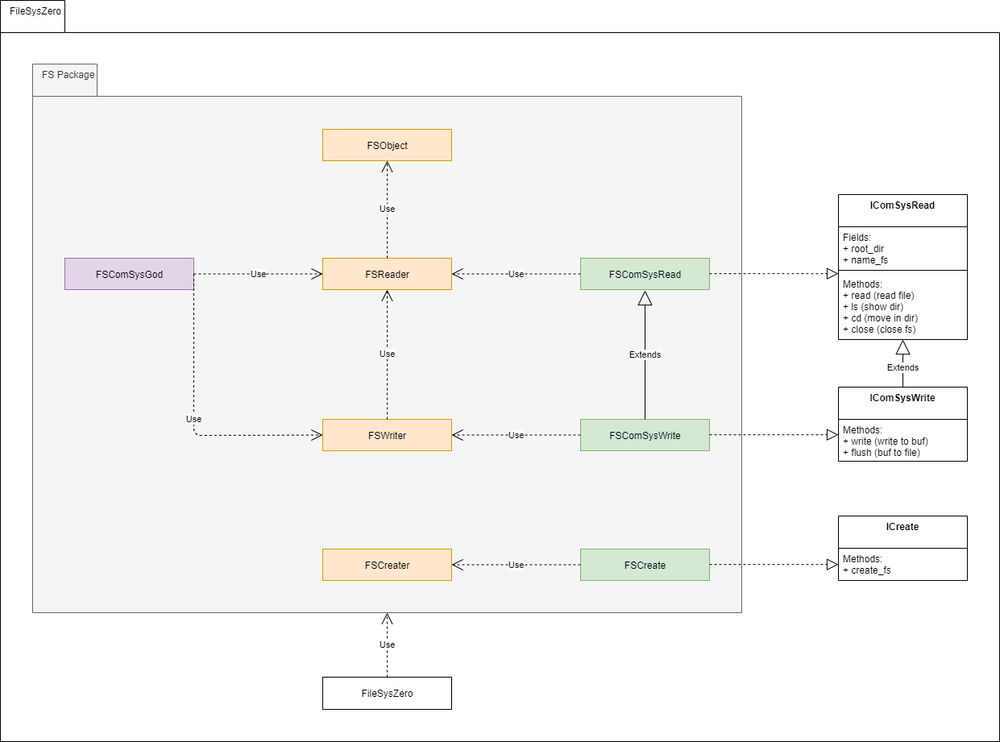

# Архитектура пакета FileSysZero

Пакет FileSysZero представляет из себя инструмент для работы с файловыми системами (далее фс), для это он должен соответствовать
следуюшим требованиям:
* Определение фс.
* Просмотр содержимого фс.
* Чтение данных из файлов фс.
* Редактирование данных в файлах фс.
* Создание и удаление содержимого фс.
* Модификация содержимого фс.
* Создание пустого образа фс.

Вариант при котором для каждого типа файловой системы будет создаваться свой класс с названиями типа "FAT", "ext" 
не является хорошей идеей ввиду большого разнообразия различных файловых систем, что будет вызывать неудобство
пользователя, хотя и реализация общей системы упростится ввиду отсутствия зависимостей.

Ввиду существования большого количества различных фс лучшим решением будет отделение каждого модуля фс в отдельный пакет, 
который сможет быть развернут FileSysZero отдельно, по запросу, это так же сделает возможность модульного использования пакета.

Общие соглашения по стилю:
* Документация обязательна для любого метода, минимально на русском языке.
* Любой вывод справочной информации, текста ошибок должен быть на английском языке.

Примерный вид графа зависимостей, FS - это название какой-либо файловой системы, ниже будет приведено краткое описание графа.
Более подробное описание каждого класса можно найти в конце. 

Центральный класс FileSysZero - фабрика отдающая необходимый объект командной системы с нужным уровнем доступа.
Так же центральный класс должен проверить тип переданного файла на возможность нести на борту фс.

Помимо центрального класса, существует еще 3 интерфейса.
* Чтение из фс: IComSysRead 
* Изменение в фс: IComSysWrite, причем он должен являтся расширением интерфейса IComSysRead 
* Создание фс: IComSysCreate

Каждый пакет должен представлять из себя приватную часть, оранжевая на изображении, в нее входят:
* FSObject - Класс содержит в себе основные значения фс, обычно это первые 512 байт загрузочного сектора + другие структуры фс
с диска, в эти структуры не входят файлы, или карты дисков.
* FSReader - Класс использует FSObject для того, чтобы реализовывать все операции для чтения файла из фс, но сам он этого делать
не должен, для этого существует класс FSComSysRead.
* FSWriter - Класс использует FSReader и FSObject (Но берет его непосредственно из FSReader). Для реализации всех операций  
необходимых для записи на фс, но сам он этого делать не должен, для этого существует класс FSComSysWrite
* FSCreator - Класс должен реализовать в себе необходимые для создания фс механики, которые будут задействованны в
FSComSysCreate.
  
Так же в пакет обязательно должны быть включины публичные реализации интерфейсов из пакета FileSysZero
* FSComSysRead - класс в котором необходимо реализовать чтение файла, благодаря операциям из FSReader.
* FSComSysWrite - класс в котором необходимо реализовать запись в фс, при этом он должен являться расширением FSComSysRead.
* FSComSysCreate - класс с единственным методом, инкопсулирующий в себе всю логику создания фс.

В пакете так же присутствует публичный файл FSComSysGod(фиолетовый), для него не существет интерфейса в FileSysZero, т.к. он
по сути обладает механикой бога: чтение любых частей фс, доступ на запись(при наличии такого у файла фс) в таблицы файлов
в их заголовки и даже в саму MBR, по возможности должен иметь подсказки ко всему чему можно, так как фс различны, то
методы могут быть различны у разных фс.

Стоит отдельно сказать, зачем интерфейс записи и его реализация имеют в предках интерфейс чтения и его реализацию соответственно.
Это сделано ввиду того, чтобы для записи не приходилось иметь огромные обьемы данных сопутствующей информации, например
последовательность кластеров, состояния соседних секторов.

Любой файл связанный непосредственно с фс должен именоваться по шаблону:
* Объект фс: [NameFS]Object
* Чтение фс: [NameFS]Reader
* Изменение фс: [NameFS]Writer
* Создание фс: [NameFS]Creator

Любой файл связанный непосредственно с командной системой фс должен именоваться по шаблону:
* Чтение из фс: [NameFS]ComSysRead 
* Изменение в фс: [NameFS]ComSysWrite
* Создание фс: [NameFS]ComSysCreate
* Индивидуальные операции доступа для каждой фс: [NameFS]ComSysGod 

### Ощибки
(0) FileNotRecognizedAsFileSystem

### Классы

(0) FileSystemZero:

        IN: (file_path: str, mode: str, file_systems_names: str)
        OUT: FSobj
        Error: (0) FileNotRecognizedAsFileSystem
        
        file_path - Путь до файла с предпологаемой фс.[1] 
        mode - Режим открытия фс (r - чтение, w - запись, c - создание).
        file_systems_names - Название файловой системы.

        [1]: Файловые системы используют ограниченное кооличество файловых форматов, работа со всеми желательно должна быть
                реализованна, но первостепенная задача заключается в работе с чистым бинарным потоком.(.img)
    
        
(1) FileSystemFactory

#### Interface FS:
(0) IComSysRead:

        Constant: 
            *  + Name file system
            *  + Root dir

        Methods:
            *  + ls - output directory contents
            *  + cd - next directory
            *  + read - read file
            *  + close - closing file (write buf to file)

(1) IComSysWrite:

        Constant: 

        Methods:
            *  + write - write to buf.
            *  + flush - write buf to file

(2) IComSysCreate:

        Constant: 

        Methods:
            *  + create - create file system
